# Weakly Supervised Segmentation with TensorFlow

This repo contains a TensorFlow implementation of weakly supervised instance segmentation as described in **Simple Does It: Weakly Supervised Instance and Semantic Segmentation**, by Khoreva et al. (CVPR 2017).

The idea behind *weakly supervised segmentation* is to **train a model using cheap-to-generate label approximations** (e.g., bounding boxes) as substitute/guiding labels for computer vision classification tasks that usually require very detailed labels. In *semantic labelling*, each image pixel is assigned to a specific class (e.g., boat, car, background, etc.). In *instance segmentation*, all the pixels belonging to the same object instance are given the same instance ID.

Per [[2014a]](#2014a), pixelwise mask annotations are far more expensive to generate than object bounding box annotations (requiring up to 15x more time). Some models, like Simply Does It (SDI) [[2016a]](#2016a) claim they can use a weak supervision approach to reach **95% of the quality of the fully supervised model**, both for semantic labelling and instance segmentation.

# Simple Does It (SDI)

## Experimental Setup for Instance Segmentation

In weakly supervised instance segmentation, there are **no pixel-wise annotations** (i.e., no segmentation masks) that can be used to train a model. Yet, we aim to train a model that can still predict segmentation masks by only being given an **input image and bounding boxes for the objects of interest** in that image.

The masks used for training are **generated** starting from individual object bounding boxes. For **each** annotated bounding box, we generate a segmentation mask using the **GrabCut method** (although, any other method could be used), and train a convnet to regress from the image and bounding box information to the instance segmentation mask. 

Note that in the original paper, a more sophisticated segmenter is used (M∩G+). 

## Network

SDI validates its work repurposing two different instance segmentation architectures (DeepMask [[2015a]](#2015a) and DeepLab2 VGG-16 [[2016b]](#2016b)). Here we use the **OSVOS** FCN (See section 3.1 of [[2016c]](#2016c)).

## Setup

The code in this repo was developed and tested using Anaconda3 v.4.4.0. To reproduce our conda environment, please use the following files:

*On Ubuntu:*
- [dlubu36tfwss.yml](tfwss/setup/dlubu36tfwss.yml)
- [requirements_ubu.txt](tfwss/setup/requirements_ubu.txt)

*On Windows:*
- [dlwin36tfwss.yml](tfwss/setup/dlwin36tfwss.yml)
- [requirements_win.txt](tfwss/setup/requirements_win.txt). 

## Jupyter Notebooks

The recommended way to test this implementation is to use the following jupyter notebooks:

- [`VGG16 Net Surgery`](tfwss/net_surgery.ipynb): The weakly supervised segmentation techniques presented in the "Simply Does It" paper use a backbone convnet (either DeepLab or VGG16 network) **pre-trained on ImageNet**. This pre-trained network takes RGB images as an input (W x H x 3). Remember that the weakly supervised version is trained using **4-channel inputs: RGB + a binary mask with a filled bounding box of the object instance**. Therefore, we need to **perform net surgery and create a 4-channel input version** of the VGG16 net, initialized with the 3-channel parameter values **except** for the additional convolutional filters (we use Gaussian initialization for them).
- [`"Simple Does It" Grabcut Training for Instance Segmentation`](tfwss/model_train.ipynb): This notebook performs training of the SDI Grabcut weakly supervised model for **instance segmentation**. Following the instructions provided in Section *"6. Instance Segmentation Results"* of the **"Simple Does It"** paper, we use the Berkeley-augmented Pascal VOC segmentation dataset that provides per-instance segmentation masks for VOC2012 data. The Berkley augmented dataset can be downloaded from [here](http://www.eecs.berkeley.edu/Research/Projects/CS/vision/grouping/semantic_contours/benchmark.tgz). Again, the SDI Grabcut training is done using a **4-channel input** VGG16 network pre-trained on ImageNet, so make sure to run the [`VGG16 Net Surgery`](tfwss/net_surgery.ipynb) notebook first!
- [`"Simple Does It" Weakly Supervised Instance Segmentation (Testing)`](tfwss/model_test.ipynb): The sample results shown in the notebook come from running our trained model on the **validation** split of the Berkeley-augmented dataset.

## Link to Pre-trained Model

Dataset with "grabcut" segmentations and results as well as pre-trained models (`vgg_16_4chan_weak.ckpt-50000`) can be found [here](http://bit.ly/tf-wss).

## Training

The fully supervised version of the instance segmentation network whose performance we're trying to match is trained using the RGB images as inputs. The weakly supervised version is trained using **4-channel inputs: RGB + a binary mask with a filled bounding box of the object instance**. In the latter case, the same RGB image may appear in several input samples (as many times as there are object instances associated with that RGB image).

To be clear, the output labels used for training are **NOT** user-provided detailed groundtruth annotations. There are no such groundtruths in the weakly supervised scenario. Instead, the **labels are the segmentation masks generated using the GrabCut+ method**. The weakly supoervised model is trained to regress from an image and bounding box information to a **generated** segmentation mask.

## Testing

The sample results shown here come from running our trained model on the **validation** split of the Berkeley-augmented dataset (see the testing notebook). Below, we (very) subjectively categorize them as "pretty good" and "not so great".

### Pretty good

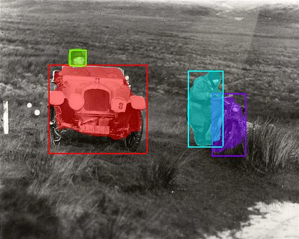 

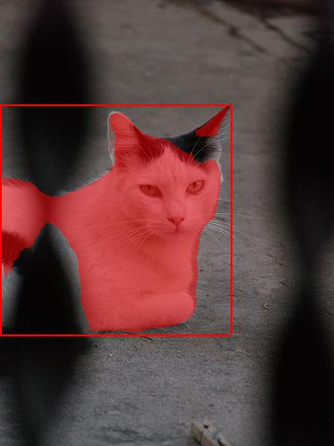

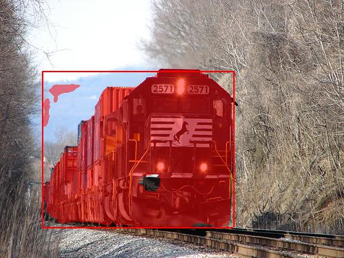

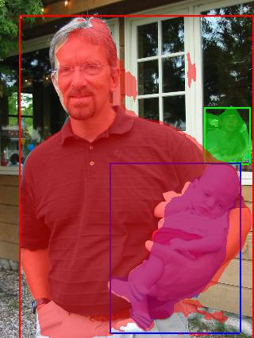

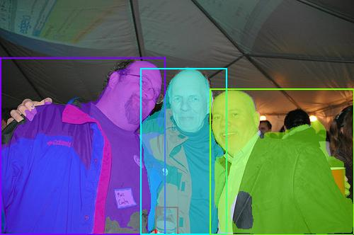

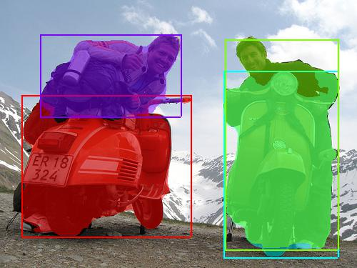

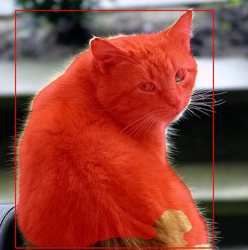

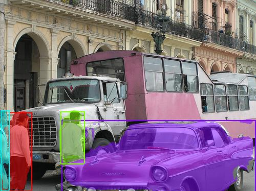

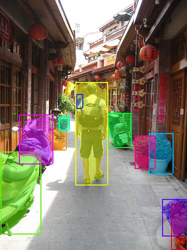

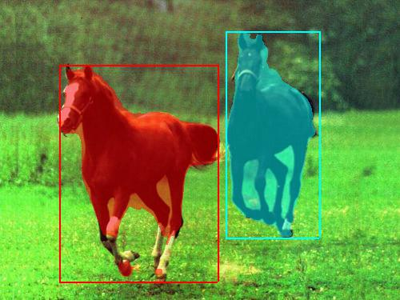

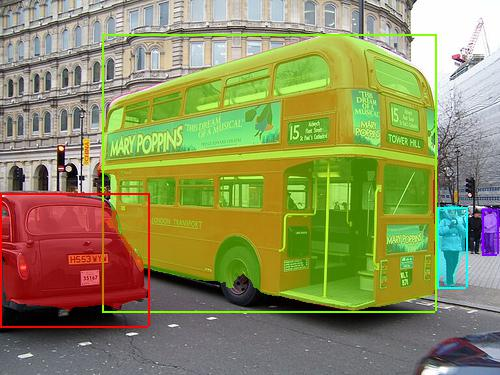

### Not so great

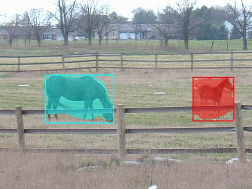

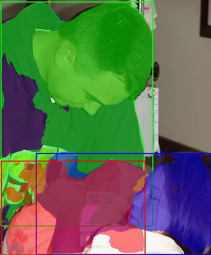

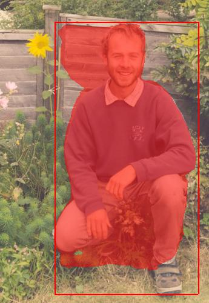

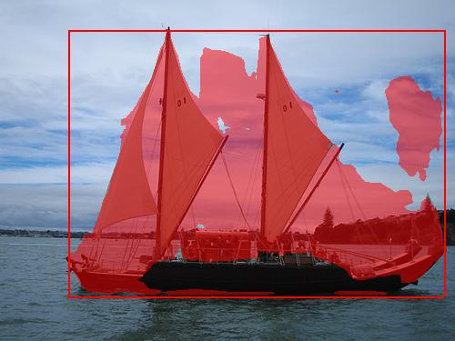

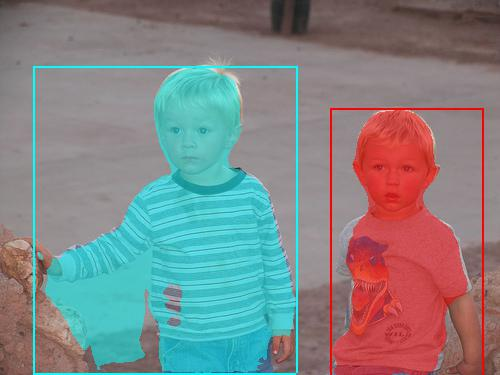

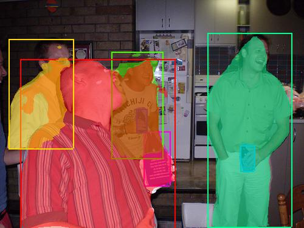

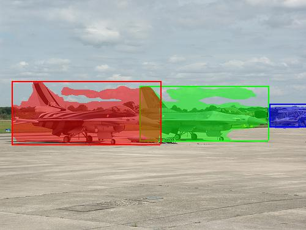

# References

## 2016
- [2016a] Khoreva et al. 2016. Simple Does It: Weakly Supervised Instance and Semantic Segmentation. [[arXiv]](https://arxiv.org/abs/1603.07485) [[web]](https://www.mpi-inf.mpg.de/departments/computer-vision-and-multimodal-computing/research/weakly-supervised-learning/simple-does-it-weakly-supervised-instance-and-semantic-segmentation/)
- [2016b] Chen et al. 2016. DeepLab: Semantic Image Segmentation with Deep Convolutional Nets, Atrous Convolution, and Fully Connected CRFs. [[arXiv]](https://arxiv.org/abs/1606.00915)
- [2016c] Caelles et al. 2016. OSVOS: One-Shot Video Object Segmentation. [[arXiv]](https://arxiv.org/abs/1611.05198)

## 2015

- [2015a] Pinheiro et al. 2015. DeepMask: Learning to Segment Object Candidates. [[arXiv]](https://arxiv.org/abs/1506.06204)

## 2014
- [2014a] Lin et al. 2014. Microsoft COCO: Common Objects in Context. [[arXiv]](https://arxiv.org/abs/1405.0312) [[web]](http://cocodataset.org/#home)
